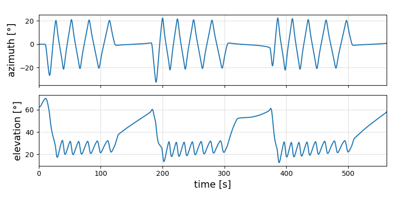
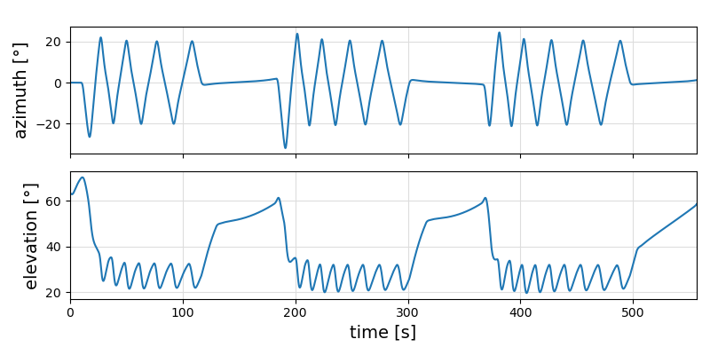

# Learning the controller parameters

For each kite, but also for different wind conditions different controller settings are needed. It should be possible to determine them automatically.

## The menu learning
The function `menu_learning()` can be used to access the following menu:

```text
Project: hydra20_600.yml  — Choose function to execute or `q` to quit: 
 > select_project()
   include("clear_corrections.jl")
   train()
   plot()
   residual(full_sim=true)
   plot(full_sim=true)
   include("autopilot.jl")
   open_documentation()
   quit
```

Currently, it only allows to determine correction vectors for the flight path planner.

How it works:
- select the project to work with
- clear the old settings
- run the train() function, which runs up to 70 simulations to determine the optimal correction vector; it is stored in the project specific flight path planner yaml file
- plot() shows the short simulation result for the optimal parameters
- residual(full_sim=true) runs a 1000s simulation with the new parameters
- plot(full_sim=true) plots the result
- you can run the autopilot GUI with the new settings for further investigation of the result
- you can open this html documentation
- and finally quit the menu


### Flight path without correction



The minimal elevation angle is now 12.5 °. This is lower than intended. Intended is an elevation angle of 26 ° $\pm$ 5 ° for optimal power harvesting and safety.

### Flight path with correction



The minimal elevation angle is now 19.6 °. This increases the safety and also - a little bit - the power output, because a kite that flies too low harvests less wind energy.

