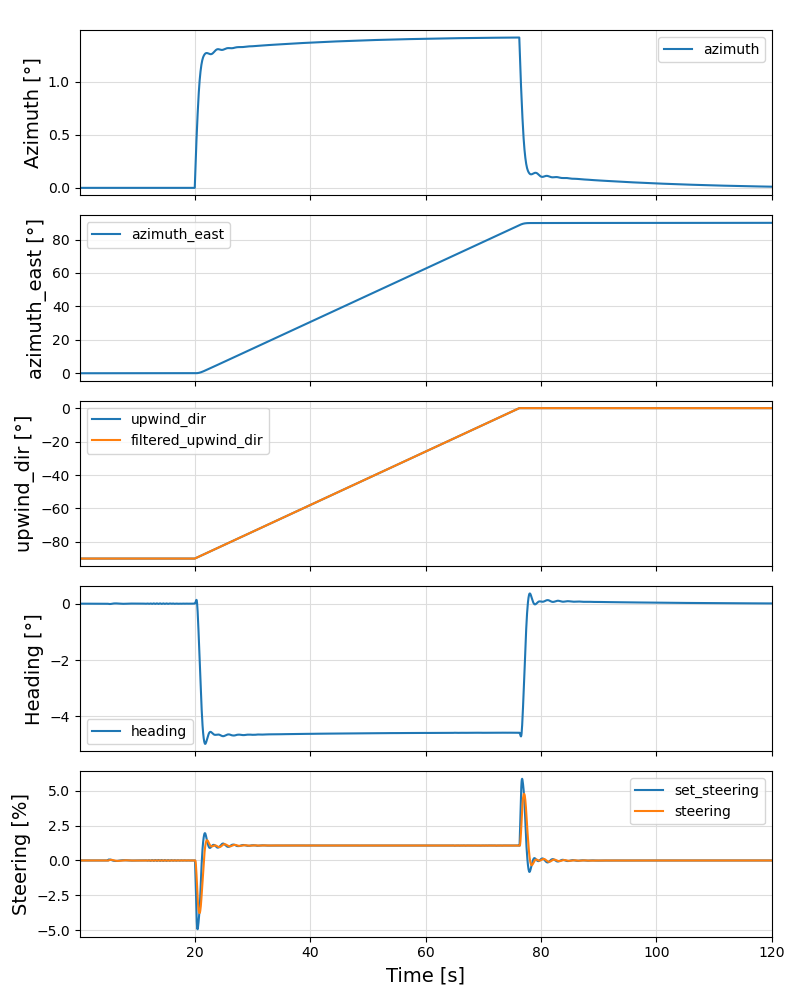
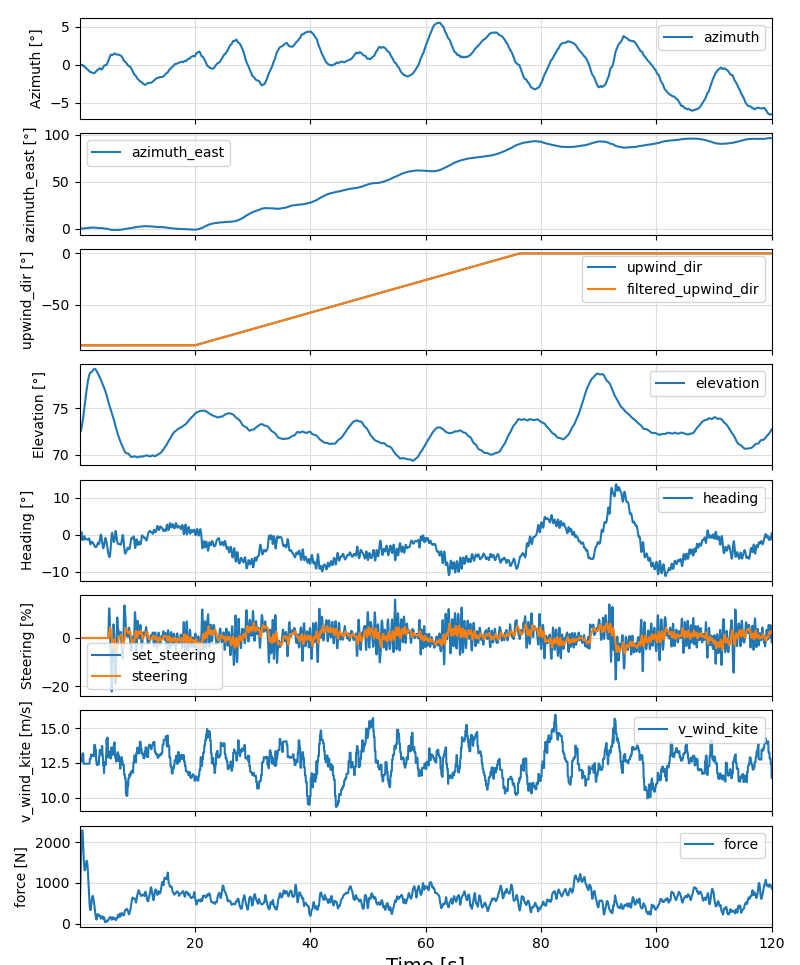

# Projects and Turbulence

## Projects
Projects are files with the ending `.yml` in the `data` folder.

As example, the file `hydra20_600_TI0.yml`:

```yaml
system:
    sim_settings: "settings_hydra20_600.yaml" # model and simulator settings
    wc_settings:  "wc_settings_8000.yaml"     # winch controller settings
    fpc_settings: "fpc_settings_hydra20.yaml" # flight path controller settings
    fpp_settings: "fpp_settings_hydra20.yaml" # flight path planner settings
overwrite:
    use_turbulence: 0.0                       # turbulence intensity relative to Cabauw, NL
```

The turbulence intensity is not specified in percent, but relative to a one year average at the location Cabauw, The Netherlands.

The file naming follows the convention:

```text
<kite name><projected kite area>_<ground wind speed in 1/100 m/s>_TI<use_turbulence>.yml
```

## The file `gui.yaml`

Example:

```yaml
gui:
    project: hydra20_600.yml             # or hydra20_600.yml
    default_turbulence: 1.0              # default turbulence level for simulations, between 0.0 and 1.0
```

The file `gui.yaml` stores the active project and the default turbulence. Both can be changed using a menu entry. Only the following examples are using the active project:

- autopilot.jl
- learn\_corrections.jl
- create\_wind\_fields.jl
- batch\_plot.jl

## The main menu

```text
Choose function to execute or `q` to quit: 
 > select_project()
   set_turbulence = set_default_turbulence()
   autopilot_4p = include("autopilot.jl")
   batch_pilot = include("batch_pilot.jl")
   batch_plot = include("batch_plot.jl")
   create_wind_fields = include("create_wind_fields.jl")
   joystick = include("joystick.jl")
   minipilot = include("minipilot.jl")
   minipilot_12 = include("minipilot_12.jl")
   parking_1p = include("parking_1p.jl")
   parking_4p = include("parking_4p.jl")
   parking_wind_dir = include("parking_wind_dir.jl")
 > quit
```

The first two menu entries can be used to select a project and the default turbulence.

## Turbulence

The relative turbulence (`use_turbulence`) can be specified at three locations:

1. in the project file in the section `overwrite`
2. as `default_turbulence` in the file `gui.yaml`
3. in one of the `settings_*.yaml` files in the section `environment`

The first entry has the highest priority. If you want to use the `default_turbulence`, make sure
to select a project that does not specify an `overwrite` value.

The value from the `settings_*.yaml` files is mainly used for batch operation using `batch_pilot.jl`, but
only for projects that do not define an `overwrite` value.

For further details on the mathematical model, used to create the turbulent wind field,
look at [AtmosphericModels.jl](https://opensourceawe.github.io/AtmosphericModels.jl/dev/).

The example "parking_wind_dir.jl" produces the following output:

### Without turbulence



### With turbulence (7.1% turbulence intensity)



The turbulence intensity at the height of the kite is calculated and printed when running the example.
